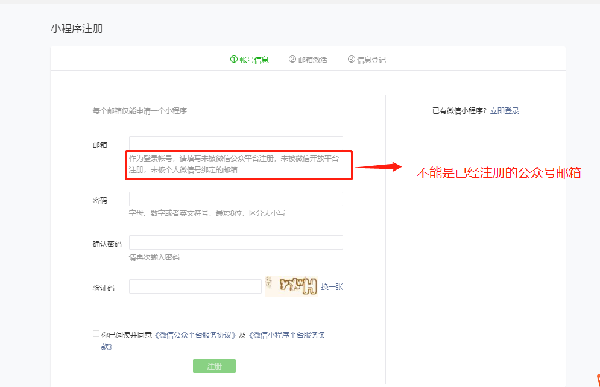
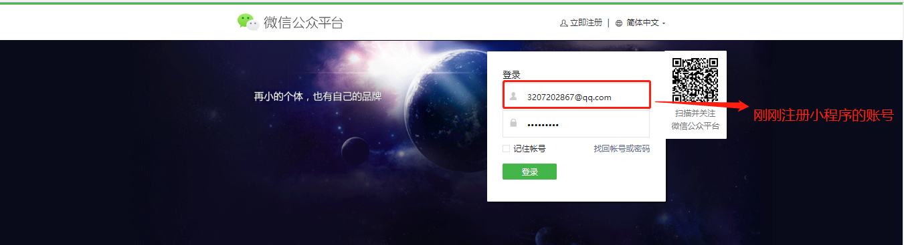
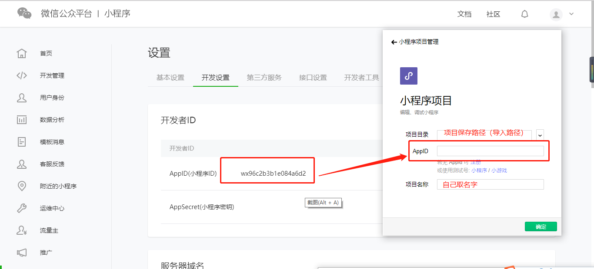
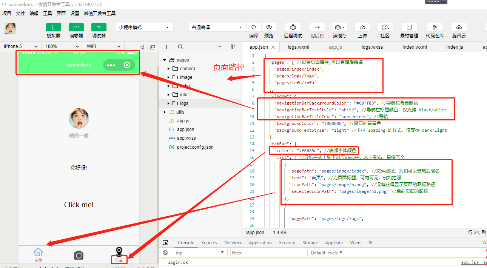
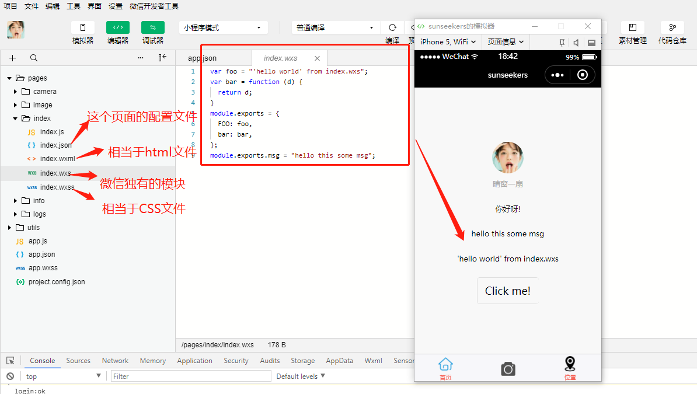
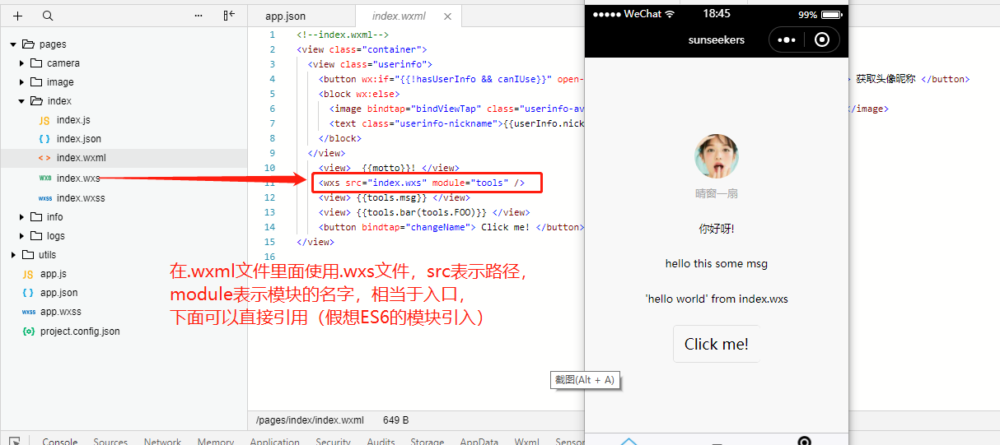

#  入门微信小程序
借助微信入口，小程序火了。刚刚出小程序那会，以为他是个高深莫测的东西，只可远观不可亵玩焉。最近尝试了一下好像入门也没有我想象的那么难，门槛也不高。看了一遍官方文档好久就了解的差不多。或许是因为语言的相通性，或许是因为它的语法和 `vue` 有异曲同工之妙，而我三大框架就只会`vue` ,小程序刚好让我给赶上了。

最开始看小程序那会我还和我朋友抱怨，太难了，学不动，不想学，不学了。现场版从入门到放弃，三分钟之后从放弃到入门，死磕了一遍文档之后。真心不难，只想说还没有尝试过，就不要轻易说放弃。

入门的时候是朋友手把手教的，那时候的我真的就像是刚刚入行的小白，其实这样也挺好，不会轻易说放弃，怕被嫌弃。

我觉得官方文档说的挺清楚，如何一步一步学习，每一个知识点都有对应的 `demo` ，在学习的时候看一遍入门应该没有问题

## 创建项目
>* 注册
>
点击 https://mp.weixin.qq.com/wxopen/waregister?action=step1 根据指引填写信息和提交相应的资料，就可以拥有自己的小程序帐号

>* 获取 `AppID`(小程序 `ID` ),创建项目

>* 下载编译器

小程序的开发虽然可以使用其他的编译器如 `vsCode`,我觉得入门的话我建议还是用他们自己的编译器
https://developers.weixin.qq.com/miniprogram/dev/devtools/download.html?t=2018712

## 创建项目
准备工作都已经齐全了，现在我们可以创建自己的小项目玩了，我建议在玩项目之前还是先读一遍[官方文档](https://developers.weixin.qq.com/miniprogram/dev/framework/MINA.html)，

>* 项目配置文件

 >* 项目构成

 
 

好了你已经入门小程序，并且学会了如何创建属于你自己的小程序了

接下来好好看看文档，学习学习他们的语法，你就可以上手项目了；
续更语法，文字版小项目。手把手教你入门小程序
(项目介绍案例地址)[]