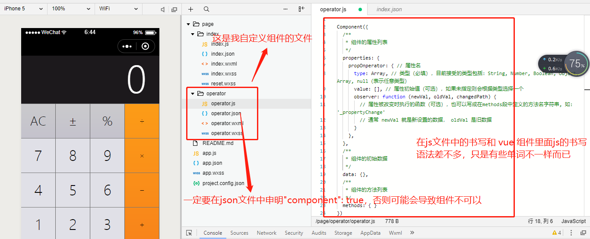
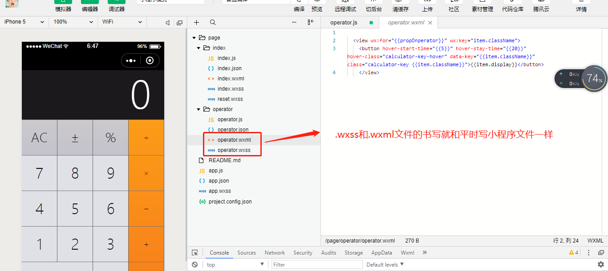
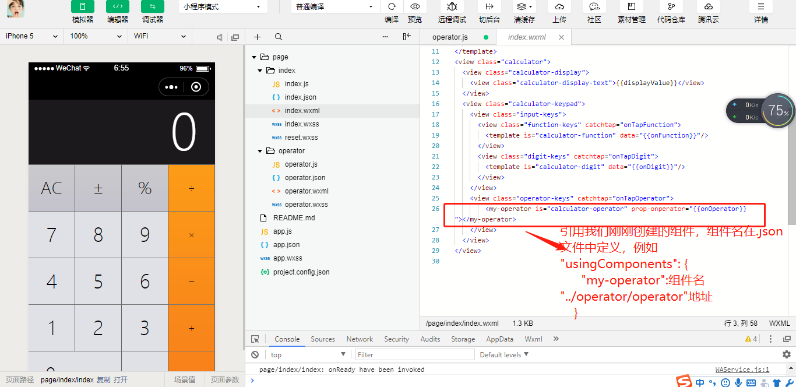

路由在项目开发中一直是个核心点，小程序路由方面经过很好的封装，提供了几个基本的跳转方法(这三个基本够用)===> 需要找案例理解
>* `wx.navigateTo(OBJECT)`：保留当前页面，跳转到应用内的某个页面，使用`wx.navigateBack` 可以返回到原页面。

>* `wx.redirectTo(OBJECT)`：关闭当前页面，跳转到应用内的某个页面。

>* `wx.navigateBack()`：关闭当前页面，回退前一页面。可通过 `getCurrentPages())` 获取当前的页面栈，决定需要返回几层

建立文件夹，建议你新建一个 `「wxml」`文件的同时，把对应的`「js」`和`「wxss」`文件一起新建好，因为微信应用号的配置特点就是解析到一个`「wxml」`文件时，会同时在同级目录下找到同文件名的`「js」`和`「wxss」`文件，所以`「js」`文件需及时在`「app.json」`里预先配置好

使用`「class」`名来设置样式，`「id」`名在这里基本没有什么用处。主要操作数据，不操作`「dom」`

 我们在用加数据模拟的时候可以将假数据写成 `JSON` 放大 `demo` 里面，一旦有接口了，我们就只需要替换接口即可

 引入 `template` 时非常方便，`is` 和 `name` 一样，`data` 是 `nameData` 传递过来的数据填充。一切都绑定数据为中心点 
 ```
 <template name="msgItem">
  <view>
    <text> {{index}}: {{msg}} </text>
    <text> Time: {{time}} </text>
  </view>
</template>

<template is="msgItem" data="{{...item}}"/>

Page({
  data: {
    item: {
      index: 0,
      msg: 'this is a template',
      time: '2016-09-15'
    }
  }
})
 ```
 ## 自定义组件
 我假设你知道 `vue` 里面是如何自定义组件的，那么我和可以和小程序的自定义组件说 `so easy`，语法有异曲同工之妙；具体怎么用我们看看就知道了。
 >* 创建组件




>* 引用组件



你现在已经知道怎么创建使用自定义组件了，就是这么简单容易。哈哈
[项目介绍案例地址](https://github.com/sunseekers/WeChatProject/tree/master/demo/calculate)

[学习资料参考](https://github.com/justjavac/awesome-wechat-weapp)
