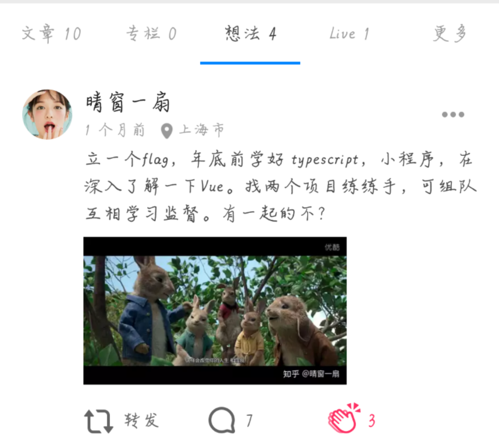
毕业之后的立的第一个 `flag` ,立完`flag`之后我就后悔了，哈哈。那时候在想如果说话可以不负责那该多好，我直接忽略这个 `flag`,哈哈，如今小程序部分学习已经完成，哈哈哈。前端明明有 `react`,`angular`两大框架我还不曾涉及，我应该选择的学习其他两个框架的，`node` 的学习我也忘记的差不多了，是时候要开始学习了。可是不知道为什么最后 `flag` 里面没有他们的学习，反而是小程序。

小程序学习并没有我想象中那么难，我就死磕了几遍官方文档，好像就懂了；对于一个只会`vue`的我来说，好像小程序的学习就是为我量身定制的样，如果你和我一样也只会 `vue` 可以入坑学习小程序的。小程序的语法和 `vue` 的语法真的很像。我们常常说所有语法都是想通的，只是语法不一样而已。仔细思考好像自己就已经会了小程序。哈哈哈。

小程序入门和语法语之前文章有介绍，在这里直接上链接[小程序语法篇](https://github.com/sunseekers/WeChatProject/blob/master/Tow.md)和[小程序入门](https://github.com/sunseekers/WeChatProject/blob/master/One.md)。这一次重点讲讲项目（学习 `vue` 的时候用的案例是一个仿`QQ`音乐了，这次小程序，直接拿`vue`仿`QQ`音乐改版成小程序了。我是如此的机智哈哈。
这是电脑版的预览效果
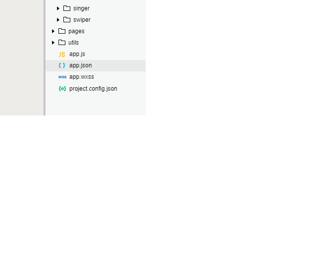

项目介绍整体框架
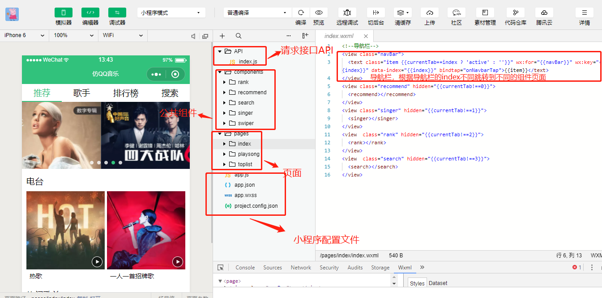
之前也想过用小程序的`navigator`组件进行跳转，但是我试过他不能到达我预期的效果，因为他只能在当前小程序内的跳转链接，没办法保持导航内容和主题内容相对应。你可以试一试，如果可以的话告诉我怎么做
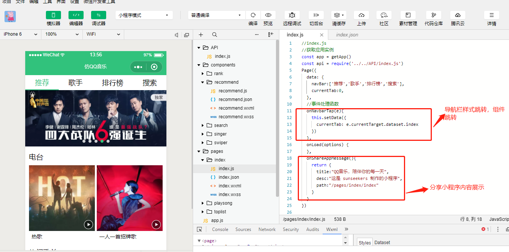
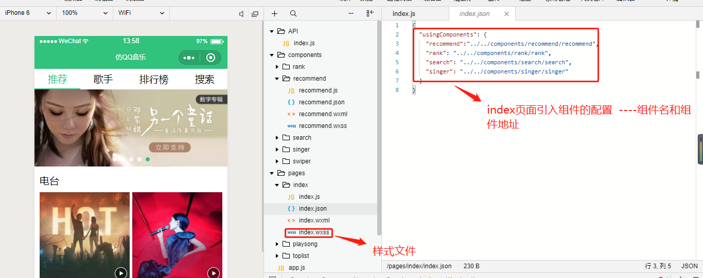
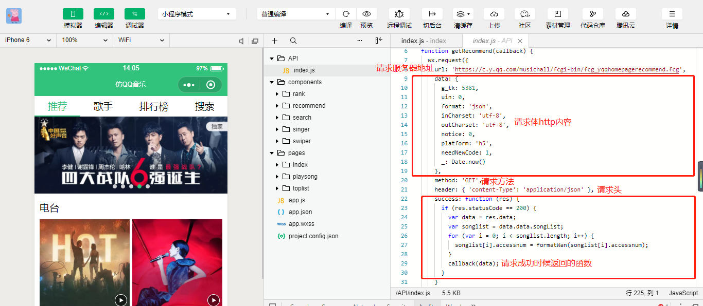
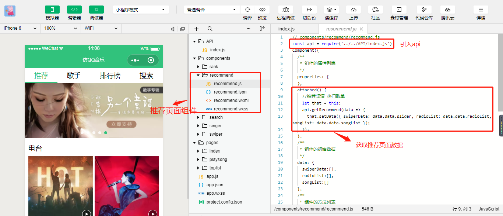
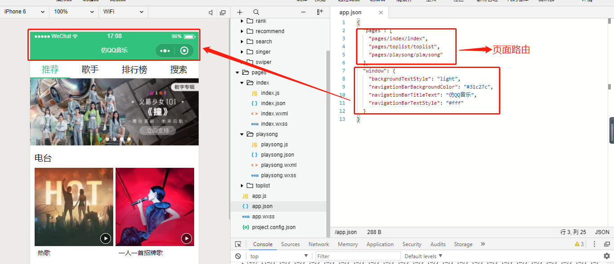
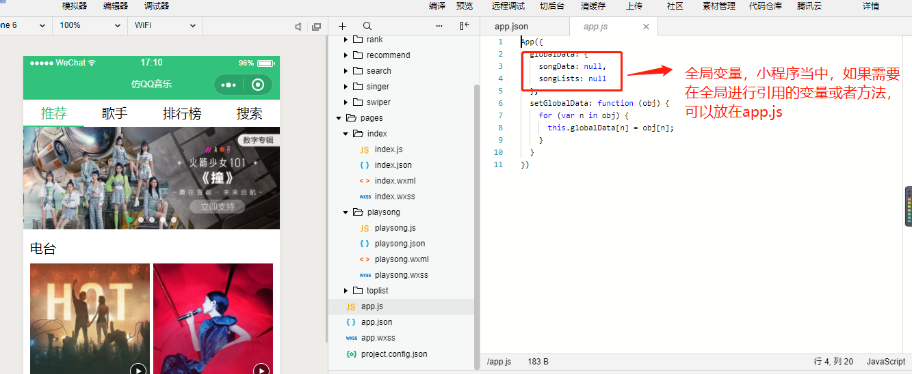
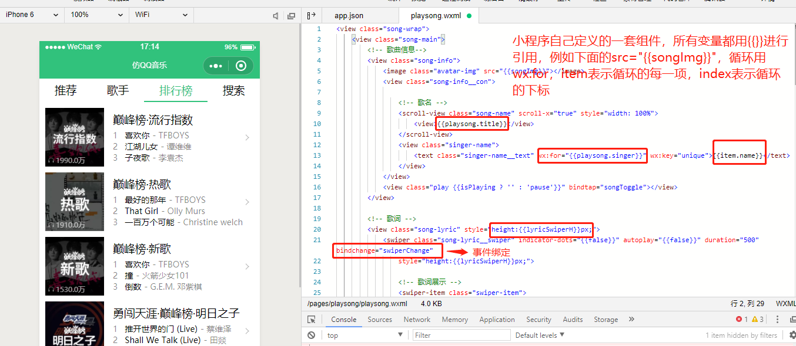
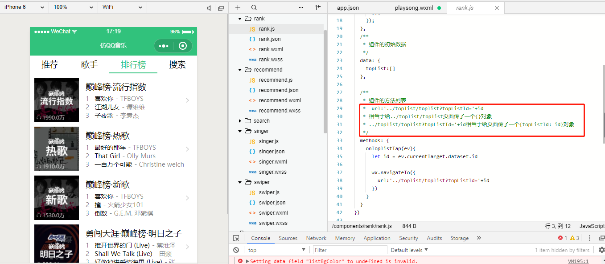
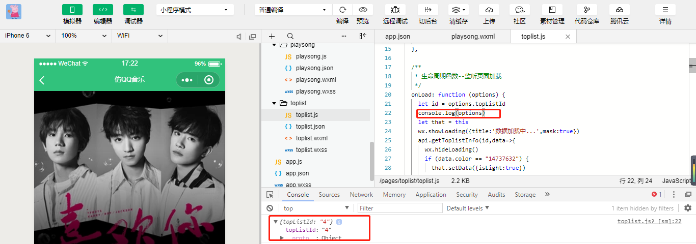
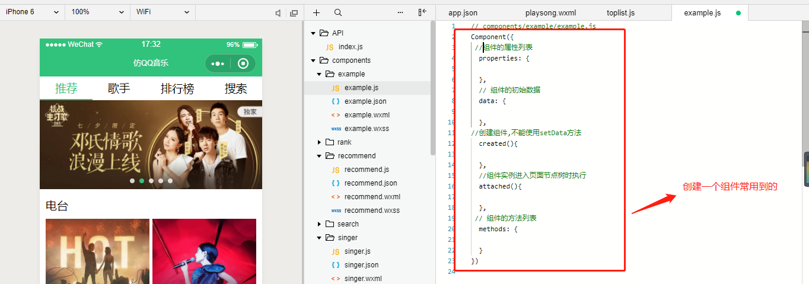
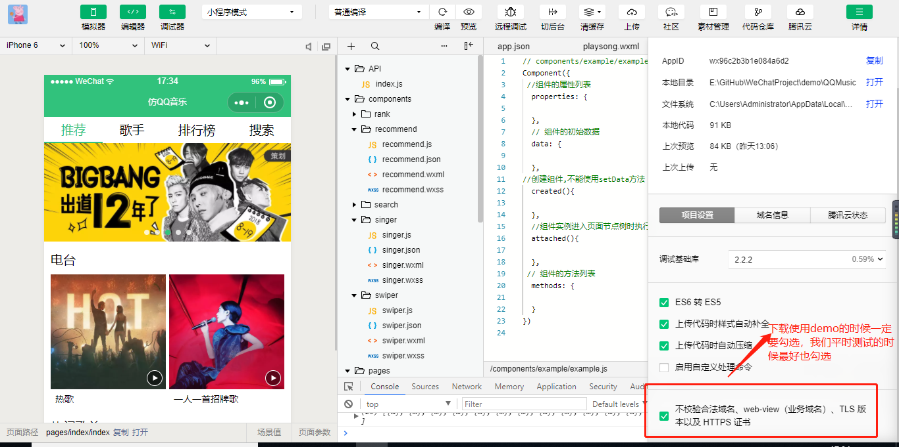
这就是整个小程序的内容，整体框架已经搭建，如果有时间会继续优化代码，把没有写完的功能继续完善；仿`QQ`音乐的接口是抓取的，现在些端口已经不能用了，有些有跨域限制。小程序的跨域我还没有试过，也不知道怎么做，好像目前是没有办法处理。选择仿`QQ`音乐做为一个小程序还有另一个原因就是，我自己觉得做再多的项目，可能只是草草完成任务，缺乏事后的思考，代码的优化扩展。那我不如把一个项目做精，在反复的练习当中，我们会不断去优化，扩展。

入坑小程序之后发现小程序还是蛮有意思的。哈哈可以入坑学习，欢迎学习交流

